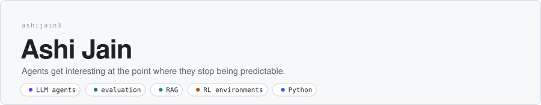
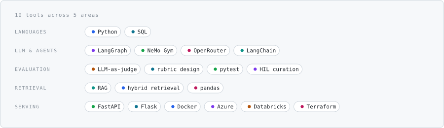

<picture>
  <source media="(prefers-color-scheme: dark)" srcset="./assets/header-dark.svg">
  
</picture>

### about.yaml

```yaml
name: Ashi Jain
role: AI Engineer

works_on:
  - trajectory-level agent evaluation: scoring whole rollouts, not single turns
  - LLM-as-judge harnesses: rubric calibration, position-bias control
  - RL environments: reward design, verifiable rewards, rollout instrumentation
  - human-in-the-loop curation: annotation QA, dedup, train/test decontamination

principles:
  - behaviour under autonomy is an empirical question, not a spec
  - an uncalibrated judge is an unmeasured model
  - annotator disagreement is signal about the rubric, not noise in the labels
  - a benchmark without a reproducible harness is an anecdote
```

### Papers


**Closing the Deal Is Not Enough: A Behavioral Rubric for Agent-to-Agent Marketplaces**
Whether AI agents negotiate fairly, protect private data, and pay safely when they trade autonomously.


**[From Raw Code to Training Data: A Production Pipeline for Enterprise Code LLM Datasets](https://dl.acm.org/doi/10.1145/3786175.3788345)**
Turning raw repositories into training data without the quality collapsing on the way.


**[Position: Early-Stage Quality Assurance in Annotation Pipelines Is More Cost-Effective Than Late-Stage Validation](https://arxiv.org/abs/2605.15714)**
The case for catching annotation errors at the source rather than auditing them afterwards.

### Stack

<picture>
  <source media="(prefers-color-scheme: dark)" srcset="./assets/stack-dark.svg">
  
</picture>

### Let's connect

<a href="https://www.linkedin.com/in/ashijain03/"></a>
&nbsp;&nbsp;&nbsp;&nbsp;
<a href="mailto:ashijain1403@gmail.com"></a>
&nbsp;&nbsp;&nbsp;&nbsp;
<a href="https://github.com/ashijain3"></a>
